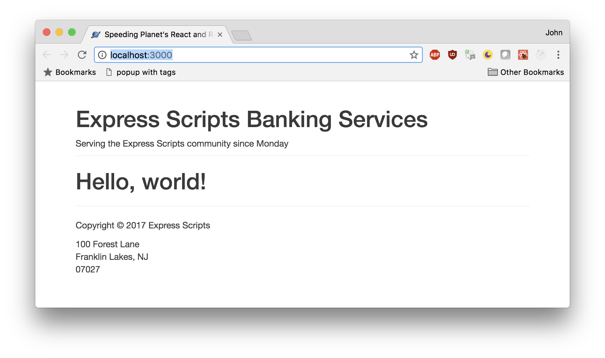

# Exercise 3 Instructions

## Objectives
* Create a CustomHeader component
* Create a CustomFooter component
* Pass properties to both components which are rendered within the component's output

## Directions
### Create a CustomHeader component
Open the file CustomHeader.tsx

Create a React component therein.
It should expect a property, `today`, which contains the day of the week.  
You will need to write a short interface which defines today as a property which 
takes a string. Then make sure that the properties passed to this component are 
typed as this new interface.  
Use that to output a message.

Consult the screenshot below to see what the output should look like

### Create a CustomFooter component
Open the file CustomFooter.tsx

Create a React component therein.
It should expect a property `company`, which has the following structure:
```javascript
  const company = {
    name   : 'Alchemax',
    address: '100 Forest Lane',
    city   : 'Metropark',
    state  : 'NJ',
    zip    : '07027'
  }
```

Again, you will have to build an interface to line up the properties to a type.
Keep in mind that you may have two interfaces, one for Company, and one for the
props, which wraps around Company. 

### Pass properties to both components....
Open App.tsx

1) Add a variable `company`, defined similar to the example above  
2) Add `<CustomHeader>` to App's return statement. Pass it the current day of the week.  
3) Add `<CustomFooter>` to App's return statement. Pass it the `company` defined in item 1 above.  

### Testing

Load [http://localhost:3000/](http://localhost:3000/) in your browser. It should look like this: 

