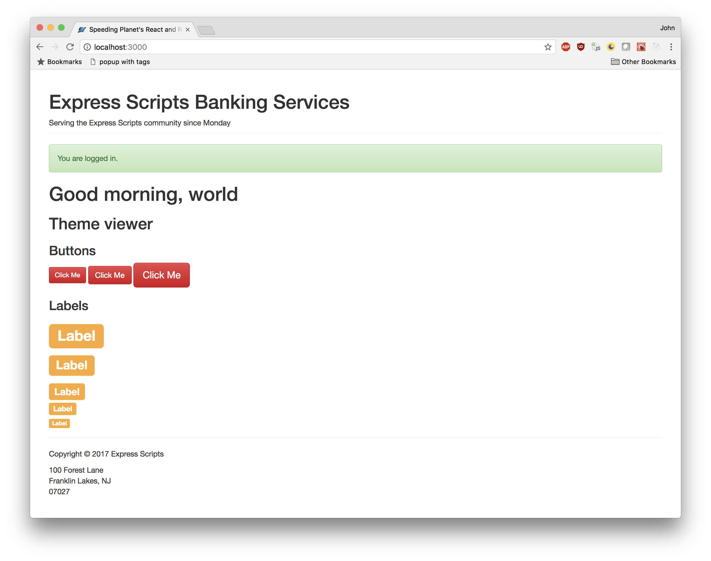
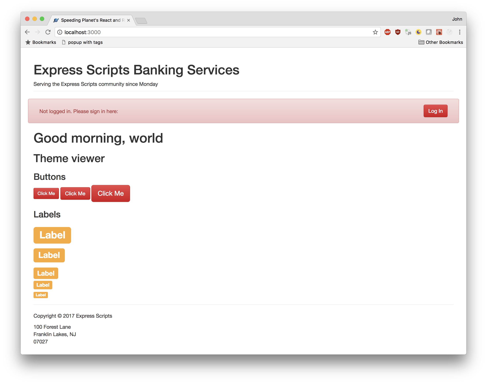

# Exercise 6 Instructions
## Objectives
1) Create a component, LoggedIn, as a banner to show when the user is logged in.  
2) Create a component, NotLoggedIn, as a banner to show when the user is **NOT** logged in.  
3) Conditionally display the appropriate banner within `<App>`.  

### LoggedIn
Open LoggedIn.tsx

Create a functional component here. The component should display a banner indicating 
that the user is logged in. You may want to use the [classes for alerts](http://getbootstrap.com/components/#alerts-examples) in Bootstrap
to get a banner effect.

### NotLoggedIn
Open NotLoggedIn.tsx

As above, create a component which displays a banner for when the user is not logged in.

### Conditionally display the appropriate banner
Open App.tsx

Before the `return` statement, initialize a variable `loggedIn`. Set it to true if the 
user is logged in, false otherwise. (Obviously, we have no user login at the moment, but 
may in the future. We are simply sketching out the UI here.)

If `loggedIn` is true, display the `LoggedIn` component. If `loggedIn` is false, 
display the `NotLoggedIn` component. 

### Testing
Load [http://localhost:3000/](http://localhost:3000/) in your browser. 

It should look like this when `loggedIn` is true: 

It should look like this when `loggedIn` is false: 

