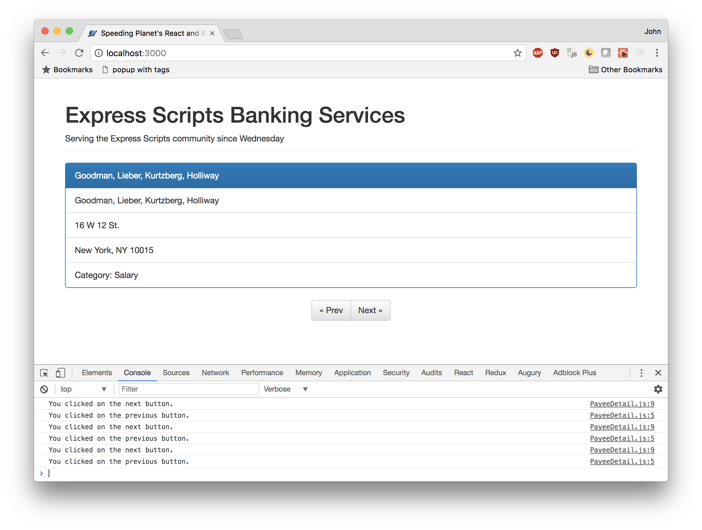

# Exercise 8 Instructions

## Objectives
* Add two buttons to the PayeeDetail component, Next and Previous
* Attach event handlers to the respective buttons
* For now, when the event handler triggers, you can simply log the event to the console

### Add two buttons to the `PayeeDetail` component
Add two buttons to the `PayeeDetail` component.  
The buttons should have `name` properties and labels to distinguish them 
from one another.  
If you want to use Bootstrap classes to make them look better, consider using
[alignment classes](http://getbootstrap.com/css/#type-alignment) to center the
buttons and maybe put them in a [button group](http://getbootstrap.com/components/#btn-groups-single)
as well. 

### Attach event handlers to their respective buttons
Write two event handlers, `handlePrevious` and `handleNext` in the component.  
(You can use either arrow or classical functions.)  
What is the proper type for the event in these event handlers? Here's a hint:
these are `MouseEvents` in `React` that we are handling which originate from
an `HtmlButtonElement`. 
The event handlers can log to the console that they fired.
Connect the event handlers to the `onClick` event on each button. 

### Testing
Open your browser to [http://localhost:3000/](http://localhost:3000/). You can 
interact with the component directly. Your screen should look something like this
